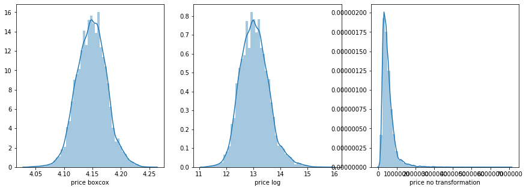
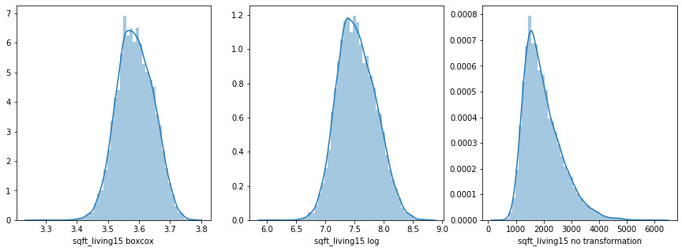

# Predicting Home Prices

## Project Goals/Overview

The purpose of this project was to use newly acquired skills in predictive regression modeling to accurately predict home prices on given 2014 & 2015 data in King County Washington (Seattle Area). We additionally took it one step further and wanted to see if the models on the 2014/15 data would still be able to work for data in 2019. This will be outlined below as the 'Original Model' (for 2014/15 data) and the 'Redfin Model' (for 2019 data).

## README Summary

In this README we will discuss our process for data cleaning, some insights that we noticed in the dataset, model selection, and how/why we applied this to 2019 data.

The final presentation can be found in the file 'Final_Presentation.pdf' or from this link: https://www.canva.com/design/DADvnqWUfzc/Hmop5bQtzVlVGN0NanWZWA/view?utm_content=DADvnqWUfzc&utm_campaign=designshare&utm_medium=link&utm_source=sharebutton

## Team Members

Carson Lloyd, Sam Videlock, Aneeta Khoso, Dylan Lisk, Anup Sebastian

## Process
### Data Cleaning

1. The original dataset is found in the csv 'kc_house_data.csv'
2. The 'Cleanup, EDA and Transformations.ipynb' file shows our complete data processing stage. Notes are compiled in the file.
3. It is interesting to note that the area measurments(sqft of lot and living space) responed well to log transformation while more  uniformly different indicators responded better to boxcox



### Original Model
This is the model using the given data for King County in 2014 & 2015.

```python
from pygam.terms import s as spline
from pygam.terms import f as factor
from pygam.terms import te as tensor


# DEFINE TERMS:
#   * splines - for continuous
#   * factors - for categorical/discrete 
#        (assumption: label encoded w/ 0 to level_size-1)
#   * tensors - for any interactions

# create the term list
term_list = []
for i, col in enumerate(used_cols):
    if col in real_cols:
        term_list.append(spline(i))

# add the x1 and x2 interaction term
term_list.append(tensor(1, 2))
term_list.append(tensor(0, 1, 2))
term_list.append(tensor(5, 6))
term_list.append(tensor(1, 2, 12))
# term_list.append(tensor(7, 8, 10))
# term_list.append(tensor(0, 4))
# term_list.append(tensor(0, 1, 2, 3))


# factors
for i, col in enumerate(used_cols):
    if col in cat_cols:
        term_list.append(factor(i))


# create the terms and model
terms = np.sum(term_list)
print(terms)
gc.collect
# gam = LinearGAM(terms=terms).gridsearch(X.values, y.values)
# gam.summary()
```
#### With those above terms created through trial and intuition.
#### The terms are summed and fed into the generalized additive model as the equation to be optimize
```python
# Playing with distribution assumptions and link functions
from pygam import GAM


gam = GAM(terms=terms, distribution='gamma', link='log')
gam.gridsearch(X.values, y.values)
gam.summary()
```

1. The 'Original_Model.ipynb' is where our final model is for the original data. Comments can be found in the file.
2. This uses data in the 'Cleaned_Housing_Data_vDL.csv' which was derived from the data cleaning python file.

### Redfin Model
This model used webscraped Redfin data to pull 2019 housing data for analysis.

1. We then retrained the Original Model with modified features so the Redfin data would run. This was because the Redfin data did not contain all of the previously available features. This file can be found in the 'Redfin_Model_Train.ipynb'.
2. Then we webscraped data using code in the 'Redfin_WebScraping.ipynb' file. This notebook is commented, and the test data is saved in 'sold_homes_model_validation_data.csv'.
3. We then tested this data on 340 sold homes in 2019 (look to the presentation for results). This data is in the 'Redfin_KC_listings.csv', and was derived from the webscraping sheet also.
4. Finally, we predicted home prices on 350 homes that are currently listed to see if we could find potential undervalued homes for flip opportunities. This can be found in the  'Redfin_Model_Predict.ipynb' file.


